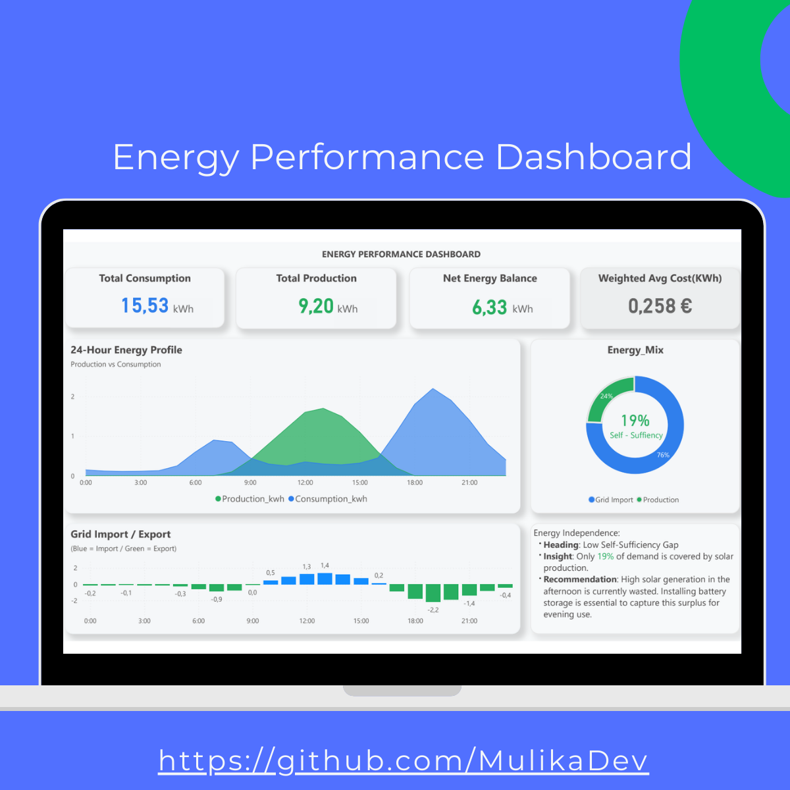

Smart City Energy Performance Dashboard ⚡📊

  An end-to-end data intelligence project that transforms raw energy metrics into actionable business insights. This project covers the entire data lifecycle: from SQL database architecture to a bespoke Power BI interface.

🎯 Business Case

  The primary goal was to quantify the "Self-Sufficiency Gap" in a Smart City district. Despite significant solar generation, the analysis reveals a 76% reliance on the external grid during evening peaks.

  Outcome: The dashboard provides a data-driven ROI justification for investing in Battery Energy Storage Systems (BESS) to capture wasted daytime surplus (currently 24% of production).

🖼️ Dashboard Preview

🛠 Tech Stack & Workflow

  Data Engineering (SQL): Designed a relational schema to handle high-frequency time-series records. Developed ETL scripts for data cleaning and transformation.

🏗 Data Architecture

  Raw smart meter data → PostgreSQL → SQL transformations → Aggregated dataset → Power BI dashboard

Analytics (DAX): Created complex measures to  calculated dynamic measures in Power BI to evaluate Self-Sufficiency (19%) and Weighted Average Energy Cost

📈 Key Insights

  Low Autonomy: Only 19% of demand is covered by local production.

  Peak Stress: Critical grid dependency identified between 18:00 and 21:00.

  Efficiency Opportunity: High potential for cost reduction through smart load shifting.
