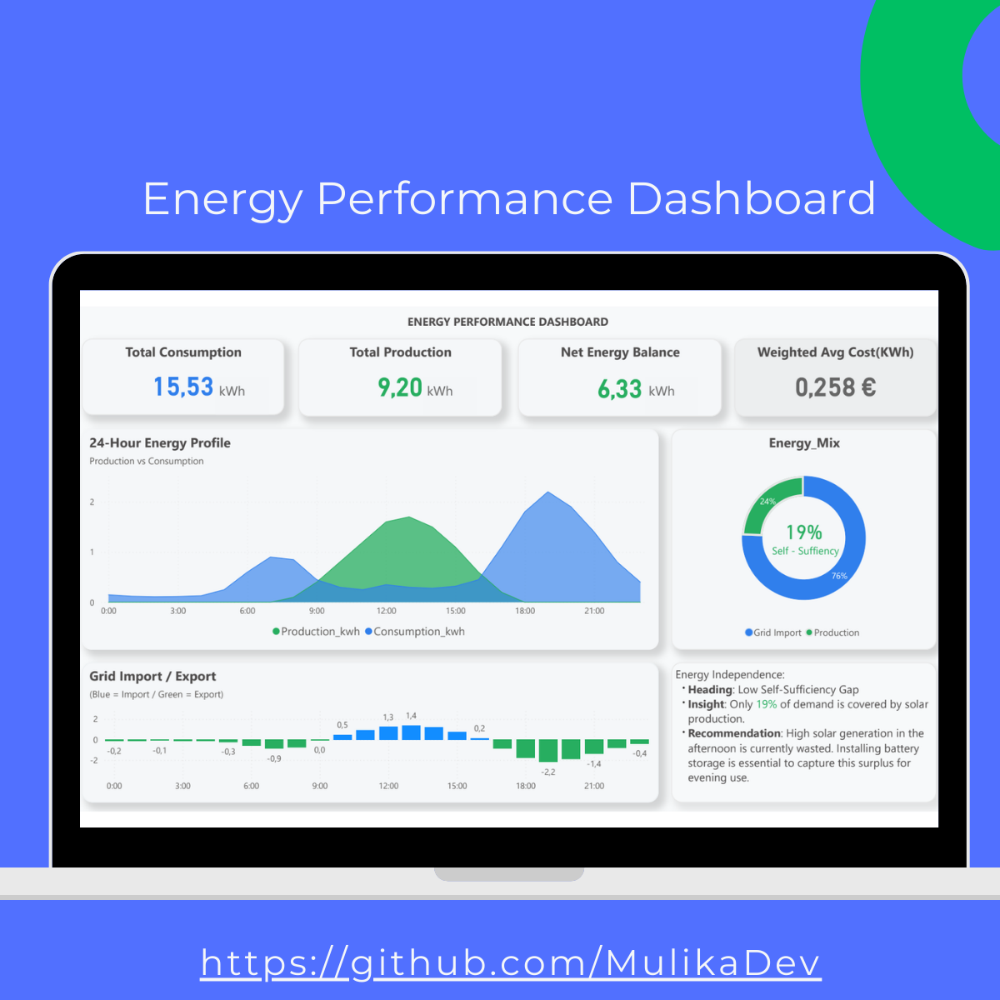

Smart City Energy Intelligence: From SQL to Power BI

I built this project to answer a critical urban question: How self-sufficient is a modern "Smart City" district when it comes to energy? Using a mix of SQL and Power BI, I tracked the tension between local solar generation and the external power grid to find where the system actually fails.

What I Built (The Tech Stack)

Database: PostgreSQL (raw smart meter data ingestion & cleaning).

Analytics: SQL for data transformations and aggregating time-series data.

BI & Viz: Power BI + DAX for calculating energy autonomy and peak-hour dependency.

The Problem & The Solution

The district produces significant solar energy, but it wasn't clear why it still leaned so heavily on the grid. I designed a pipeline that takes raw meter readings, cleans them via SQL, and visualizes the energy flow.

The main takeaway? Despite the solar panels, the district is only 19% autonomous. The real bottleneck isn't a lack of sun—it's the timing.

Key Engineering Insights

The 18:00–21:00 Gap: 76% of energy during these hours comes from the external grid.

Wasted Energy: About 24% of generated solar power is exported back to the grid because there's no way to store it locally during the day.

The Strategy: My analysis proves that implementing BESS (Battery Energy Storage Systems) is the only way to significantly move the needle on grid independence.

Future Roadmap

Integrate Predictive Modeling to forecast demand spikes.

Simulate different battery capacities to find the ROI for the city council.

